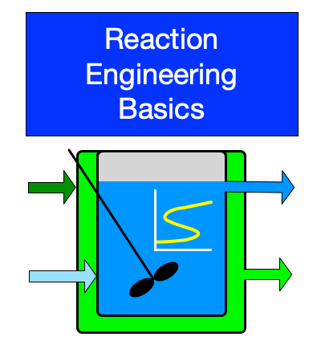

# Class 8 {.ct}

{fig-alt="Reaction Engineering Basics Logo" fig-align="center" width="200"}

## Analysis of Ideal Reactors {.cc}

Class 8 provides an overview of the modeling of a single, ideal reactor. Selection of reactor design equations, common tasks that require them, and a workflow for completing them are introduced. A procedure for qualitative prediction of reactor performance is also presented.

## Learning Outcomes {.ch}

After completing Class 8 you should...

* Know
    * the definition of an exchange fluid, sensible heat, latent heat, and reactor operations that are steady-state, transient, isothermal, adiabatic, non-isothermal, isobaric, and/or isochoric
    * the equations for an energy balance on an exchange fluid that transfers sensible heat and an exchange fluid that transfers latent heat
* Be able to
    * identify response, optimizatization, design, and parameter estimation tasks
    * determine the minimum number of mole balances and whether reacting fluid energy, exchange fluid energy, and momentum balances are needed for modeling a given reactor
    * qualitatively describe how the reaction rate, composition, temperature, and related quantities evolve with reaction time, given appropriate information about rate expressions, reaction exothermicity, and reactor heat exchange

## Prepare {.ch}

* Read Chapter 5 of REB, The Book
* Watch the Class 8 Preparation Video

## Participate {.ch}

to be added; in the activity, formulate design equations for Class 9 activity and qualitatively predict response

## Practice {.ch}

to be added


