# Assignments Involving Kinetics Data Analysis

## Examples from *REB, The Book* {.ch}

**Example 11.5.1** A rate expression for liquid-phase reaction (1) is needed for the design of a new batch reactor process. Preliminary studies suggest that a temperature in the range of 65 to 90 °C will be needed. At lower temperatures the reaction proceeds too slowly, and at higher temperatures undesired side reactions begin to occur. At a temperature of ca. 80 °C, it takes approximately 30 minutes for the reaction to go to completion. The preliminary experiments suggest that the reaction is irreversible and that the rate is not affected by the concentration of the product, Z. It is expected that the reactant, A, will be available at concentrations between 0.8 and 1.2 M. A perfectly mixed, 1 L BSTR is available for kinetics experiments. The reactor has a sampling port that allows the concentration of A to be measured while the reaction is taking place. Design a set of experiments to generate kinetics data that can be used to develop a rate expression.

$$
A \rightarrow Z \tag{1}
$$

[Example 11.5.1 Solution](examples/11_5_1/Example%2011.5.1.pdf)

---

**Example 11.5.2** The liquid-phase reaction between reactants A and B, reaction (1), was studied in a 100 cm^3^ laboratory CSTR. The reactor operated at steady state, the volumetric flow rate and the inlet concentrations of each of the reagents were adjusted from one experiment to the next, and the steady-state outlet concentration of reagent Y was measured. Use the experimental data to assess the accuracy with which the rate expression shown in equation (2) describes the rate of reaction (1). The rate coefficient in equation (2) can be assumed to exhibit Arrhenius temperature dependence.

$$
A + B \rightarrow Y + Z \tag{1}
$$

$$
r = kC_AC_B \tag{2}
$$

The first few data points are shown in @tbl-ch11_ex2_data. The full data set is available in the file [example_11_5_2_data.csv](examples/11_5_2/example_11_5_2_data.csv).

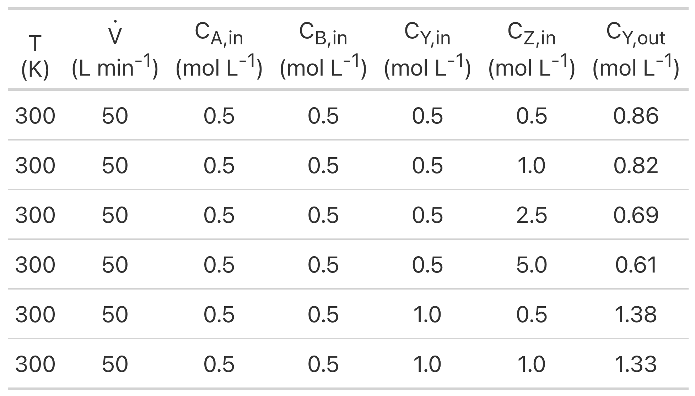{#tbl-ch11_ex2_data width="50%"}

[Example 11.5.2 Solution](examples/11_5_2/Example%2011.5.2.pdf)

[Example 11.5.2 Calculations](examples/11_5_2/example_11_5_2.py)

---

**Example 11.5.3** The liquid-phase disproportionation of reagent A, reaction (1), is reversible. Kinetics data were generated in a 3 gal CSTR by varying the temperature, volumetric flow rate and feed concentrations of reagents A, Y, and Z from experiment to experiment. In each experiment the outlet concentration of reagent A was measured. Use the resulting data to assess the accuracy of the rate expression shown in equation (2) using a fitting function and using a linearized response model.

Note that thermodynamic data to calculate the equilibrium constant for reaction (1) are not available, so both the forward and reverse rate coefficients in the rate expression must be estimated from the experimental data.

$$
A \leftrightarrows Y + Z \tag{1}
$$

$$
r = k_fC_A^2 - k_rC_YC_Z \tag{2}
$$

The first few data points are shown in @tbl-ch11_ex3_data. The full data set is available in the file [example_11_5_3_data.csv](examples/11_5_3/example_11_5_3_data.csv).

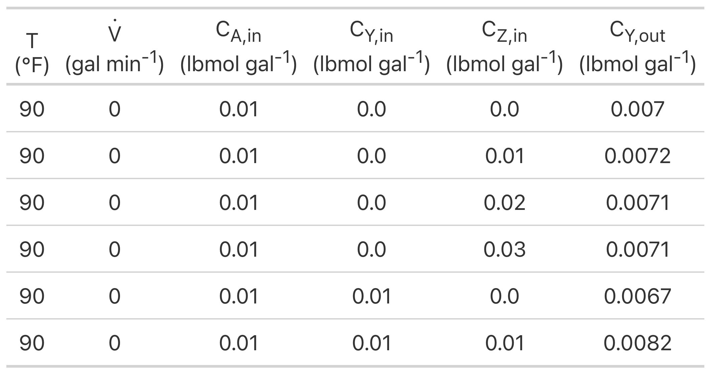{#tbl-ch11_ex3_data width="50%"}

[Example 11.5.3 Solution](examples/11_5_3/Example%2011.5.3.pdf)

[Example 11.5.3 Calculations](examples/11_5_3/example_11_5_3.py)

---

**Example 11.5.4** The gas-phase reaction between reagents A and B was studied in an ideal, isothermal, 500 cm^3^ BSTR. In all experiments the reactor was charged with reagents A and B only, but with varying partial pressures. The fractional conversion of reagent A was measured at seven different elapsed times in each experiment. Experiments were performed at three different temperatures. Assess the accuracy of the rate expression shown in equation (2) using both a fitting function approach and a linear model approach.

$$
A + B \rightarrow Y + Z \tag{1}
$$

$$
r = k P_A P_B \tag{2}
$$

The experimental data are provided in the file, [example_11_5_4_data.csv](examples/11_5_4/example_11_5_4_data.csv). The first few data points from that file are shown in @tbl-ch11_ex4_data.

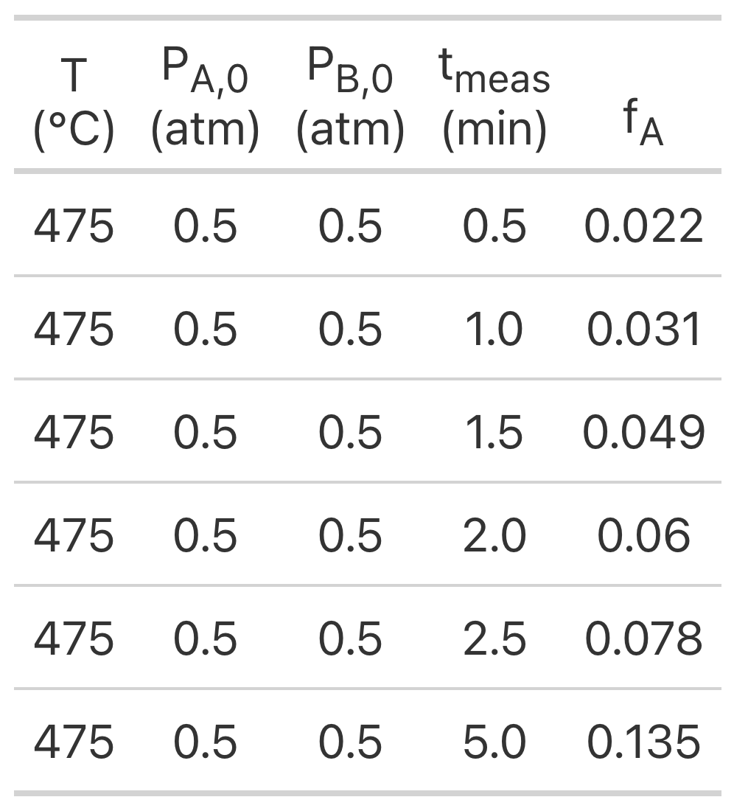{#tbl-ch11_ex4_data width="30%"}

[Example 11.5.4 Solution](examples/11_5_4/Example%2011.5.4.pdf)

[Example 11.5.4 Calculations](examples/11_5_4/example_11_5_4.py)

---

**Example 11.5.5** Reversible, gas-phase reaction (1) was studied in a PFR at 1 atm. In all experiments the same amount of catalyst, 3.0 g, was present in the reactor, forming a small packed bed. The apparent density of the catalyst bed was constant, and pressure drop across the catalyst bed was negligible. The total inlet molar flow rate was also the same in all experiments and equal to 2.5 mol h^–1^. The inlet mole fractions of A, B, Y, and Z and the temperature were varied in the experiments and the partial pressure of A, in atm, at the reactor outlet was recorded.

Preliminary experiments showed that the rate does not depend upon the partial pressure of reagent Z, and the reaction is inhibited by reagent Y. The power-law rate expression shown in equation (2) has been proposed to model the rate. The equilibrium constant, $K$ , in equation (2) can be calculated using equation (3) where $K_0$ equals 0.0132 and $\Delta H$ equals –9096 cal mol^–1^.

Use the resulting data to assess the accuracy of the proposed rate expression.

$$
A + B \rightarrow Y + Z \tag{1}
$$

$$
r = k\,P_{A}^{\alpha_A}\,P_{B}^{\alpha_B}\,P_{Y}^{\alpha_Y}\left( 1 - \frac{P_YP_Z}{KP_AP_B} \right) \tag{2}
$$

$$
K = K_0 \exp{\left( \frac{-\Delta H}{RT}\right)} \tag{3}
$$

The experimental data are provided in the file, [example_11_5_5_data.csv](examples/11_5_5/example_11_5_5_data.csv). The first few data points from that file are shown in @tbl-ch11_ex5_data.

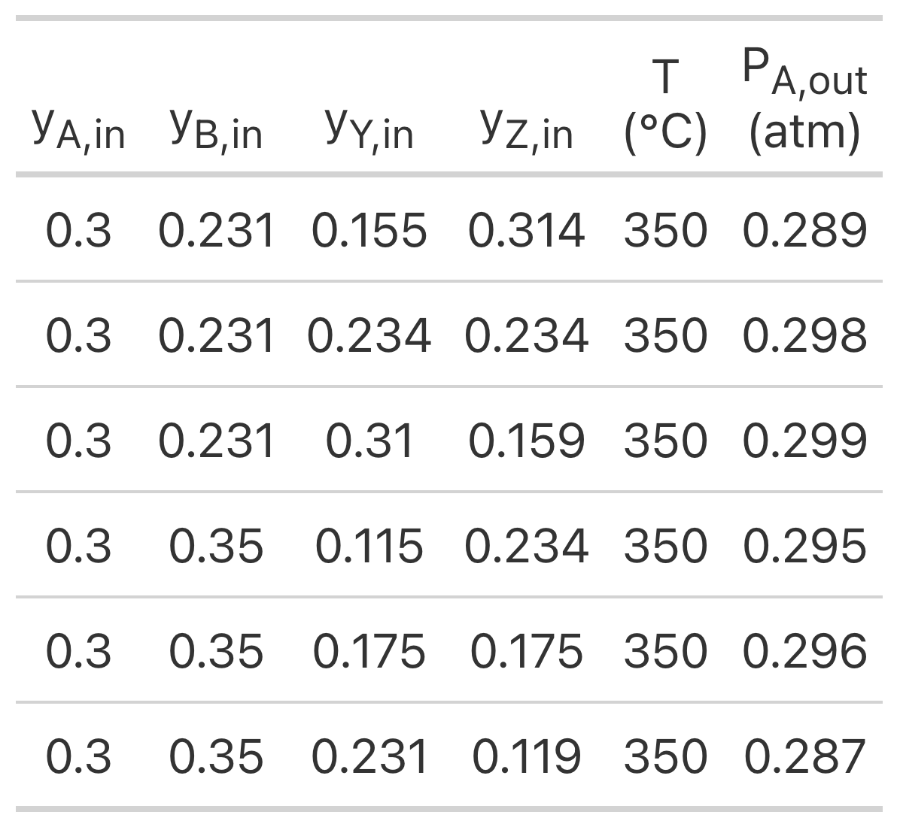{#tbl-ch11_ex5_data width="40%"}

[Example 11.5.5 Solution](examples/11_5_5/Example%2011.5.5.pdf)

[Example 11.5.5 Calculations](examples/11_5_5/example_11_5_5.py)

---

**Example 11.5.6** Kinetics data for liquid-phase reaction (1) were generated using an ideal, isothermal, 1 L BSTR. The reaction is irreversible, and preliminary analysis indicated that the rate is not affected by the concentration of the product, Z. The experimental design used the initial concentration of A and the temperature as factors. Twelve experiments were performed wherein the temperature and initial concentration of reagent A were set after which the concentration of reagent A was measured at six reaction times, giving a set of 72 experimental data points. The rate expression shown in equation (2) has been proposed for this reaction. The rate coefficient in equation (2) is expected to display Arrhenius temperature dependence. Compare the best values for the Arrhenius pre-exponential factor and activation energy determined using (a) a fitting function, (b) a linearized model, and (c) an approximate model. Then assess the accuracy of the proposed first order rate expression.

$$
A \rightarrow Z \tag{1}
$$

$$
r = k C_A \tag{2}
$$

Note that these data were generated using the experimental design from Example 11.5.1. The experimental data are provided in the file, [example_11_5_6_data.csv](examples/11_5_6/example_11_5_6_data.csv). The first few data points from that file are shown in @tbl-ch11_ex6_data.

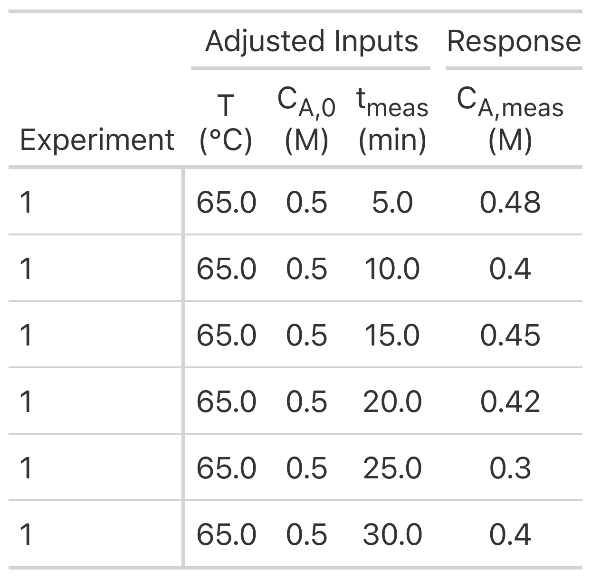{#tbl-ch11_ex6_data width="40%"}

Example 11.5.6 Solutions

* [Using a fitting function](examples/11_5_6/Example%2011.5.6%20Fitting.pdf)
* [Using a linearized model](examples/11_5_6/Example%2011.5.6%20Linear.pdf)
* [Using an approximate model](examples/11_5_6/Example%2011.5.6%20Approximate.pdf)

Example 11.5.6 Calculations

* [Using a fitting function](examples/11_5_6/example_11_5_6_ff.py)
* [Using a linearized model](examples/11_5_6/example_11_5_6_lm.py)
* [Using an approximate model](examples/11_5_6/example_11_5_6_am.py)

[Comparison of Example 11.5.6 Solutions](examples/11_5_6/Example%2011.5.6%20Comparison.pdf)

## Learning Activities from *REB, The Course* {.ch}



$$
S \rightarrow P + H_2O \tag{1}
$$

$$
r = \frac{V_{max}C_S}{K_m + C_S} \tag{2}
$$

The experimental data are provided in the file, [activity_25_data.csv](activities/class_25/activity_25_data.csv). The first few data points from that file are shown in @tbl-act_25_data.

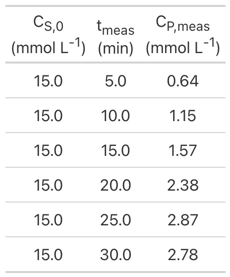{#tbl-act_25_data width="25%"}

[Learning Activity 25 Solution](activities/class_25/Activity%2025.pdf)

[Learning Activity 25 Calculations](activities/class_25/activity_25.py)

---



$$
A + B \rightarrow Y + Z \tag{1}
$$

$$
r=kC_AC_B \tag{2}
$$

The experimental data are provided in the file, [activity_26_data.csv](activities/class_26/activity_26_data.csv). The first few data points from that file are shown in @tbl-act_26_data.

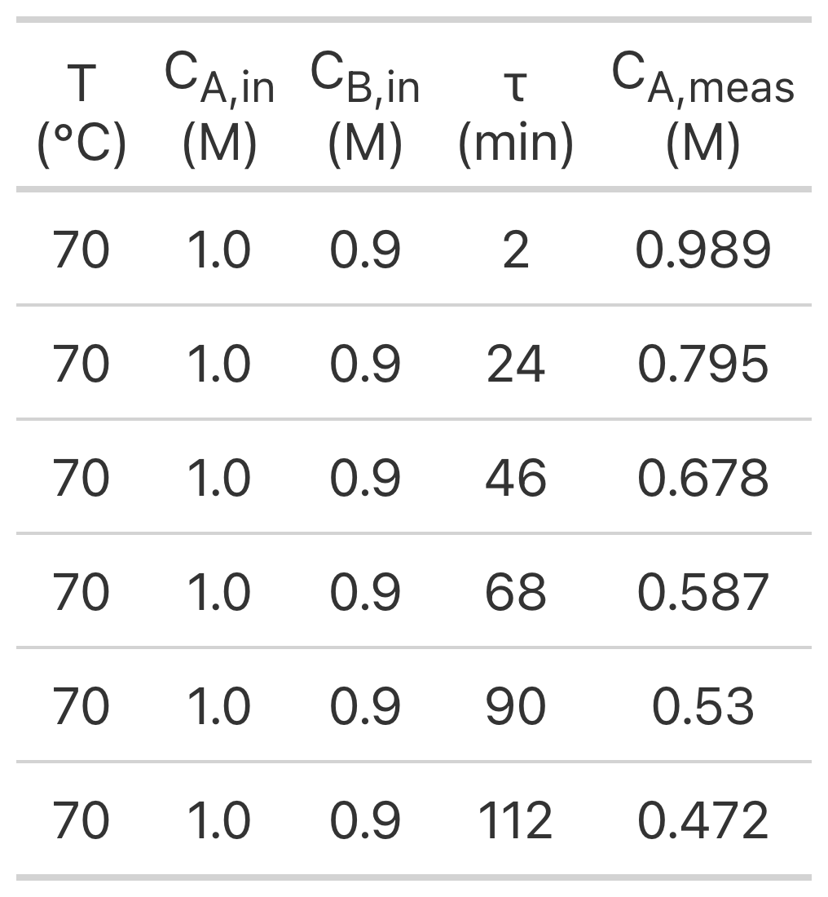{#tbl-act_26_data width="25%"}

[Learning Activity 26 Solution](activities/class_26/Activity%2026.pdf)

[Learning Activity 26 Calculations](activities/class_26/activity_26.py)

---



$$
A + B \rightarrow Y + Z \tag{1}
$$

$$
r = k C_A C_B \tag{2}
$$

The experimental data are provided in the file, [activity_27_data.csv](activities/class_27/activity_27_data.csv). The first few data points from that file are shown in @tbl-act_27_data.

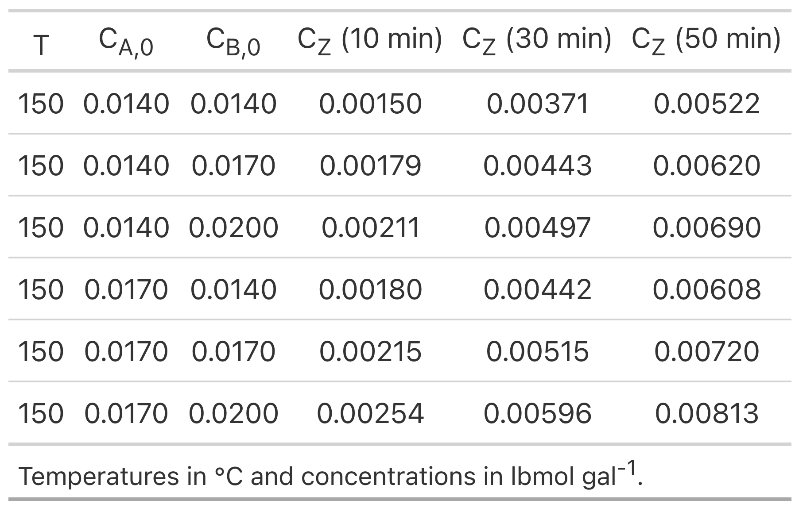{#tbl-act_27_data width="40%"}

[Learning Activity 27 Solution](activities/class_27/Activity%2027.pdf)

[Learning Activity 27 Calculations](activities/class_27/activity_27.py)

---



$$
A + B \rightarrow Y + Z \tag{1}
$$

$$
r = \frac{kP_{A}P_{B}}{1 + K_AP_A + K_BP_B + K_YP_Y + K_ZP_Z }\left( 1 - \frac{P_YP_Z}{K_1P_AP_B} \right) \tag{2}
$$

The experimental data are provided in the file, [activity_28_data.csv](activities/class_28/activity_28_data.csv). The first few data points from that file are shown in @tbl-act_28_data.

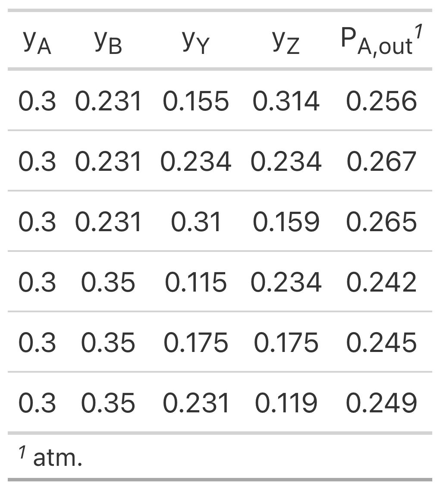{#tbl-act_28_data width="30%"}

[Learning Activity 28 Solution](activities/class_28/Activity%2028.pdf)

[Learning Activity 28 Calculations](activities/class_28/activity_28.py)

---



$$
A + B \rightarrow Z \tag{1}
$$

$$
r = k P_A \sqrt{P_B} \tag{2}
$$

The experimental data are provided in the file, [activity_29_data.csv](activities/class_29/activity_29_data.csv). The first few data points from that file are shown in @tbl-act_29_data.

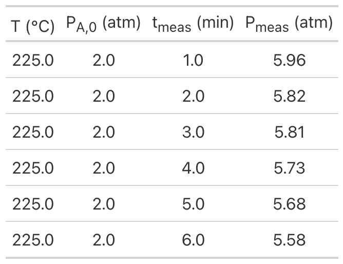{#tbl-act_29_data width="40%"}

[Learning Activity 29 Solution](activities/class_29/Activity%2029.pdf)

[Learning Activity 29 Calculations](activities/class_29/activity_29.py)

## Practice Assignments from *REB, The Course* {.ch}



$$
A + B \rightarrow Z \tag{1}
$$

$$
r=kC_AC_B \tag{2}
$$

The experimental data are provided in the file, [practice_25_data.csv](practice/class_25/practice_25_data.csv). The first few data points from that file are shown in @tbl-practice_25_data.

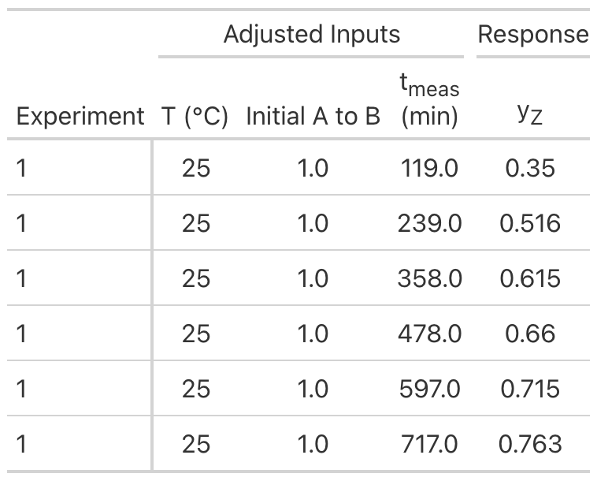{#tbl-practice_25_data width="40%"}

[Practice Assignment 25 Solution](practice/class_25/Practice%20Assignment%2025.pdf)

[Practice Assignment 25 Calculations](practice/class_25/practice_25.py)

---



$$
A \rightleftarrows Y + 3Z \tag{1}
$$

$$
r = kP_A \left(1 - \frac{P_YP_Z^3}{K_1P_A}\right) \tag{2}
$$

The experimental data are provided in the file, [practice_26_data.csv](practice/class_26/practice_26_data.csv). The first few data points from that file are shown in @tbl-practice_26_data.

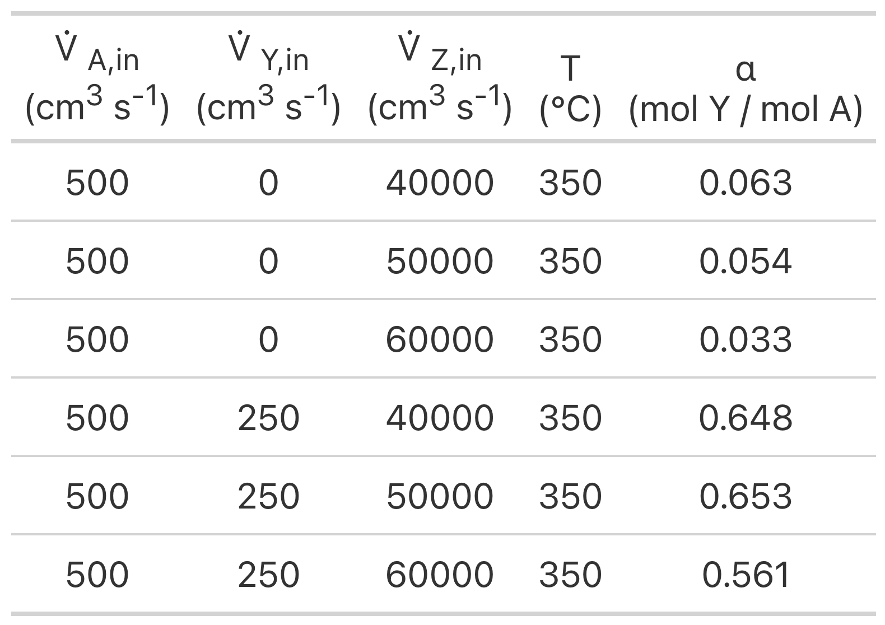{#tbl-practice_26_data width="40%"}

[Practice Assignment 26 Solution](practice/class_26/Practice%20Assignment%2026.pdf)

[Practice Assignment 26 Calculations](practice/class_26/practice_26.py)

---



$$
A + B \rightarrow Y + Z \tag{1}
$$

$$
r=kC_AC_B \tag{2}
$$

The experimental data are provided in the file, [practice_27_data.csv](practice/class_27/practice_27_data.csv). The first few data points from that file are shown in @tbl-practice_27_data.

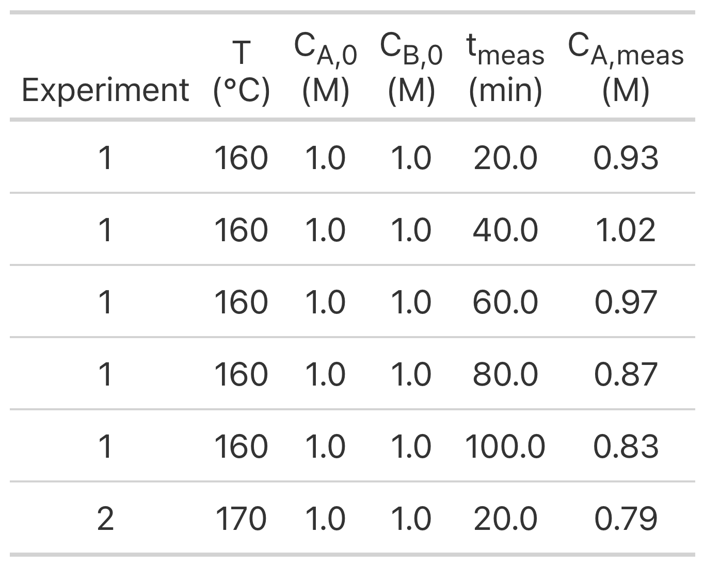{#tbl-practice_27_data width="40%"}

[Practice Assignment 27 Solution](practice/class_27/Practice%20Assignment%2027.pdf)

[Practice Assignment 27 Calculations](practice/class_27/practice_27.py)

---



$$
A + B \rightarrow Z \tag{1}
$$

$$
r = kP_A^{\alpha_A} P_B^{\alpha_B} \tag{2}
$$

The experimental data are provided in the file, [practice_28_data.csv](practice/class_28/practice_28_data.csv). The first few data points from that file are shown in @tbl-practice_28_data.

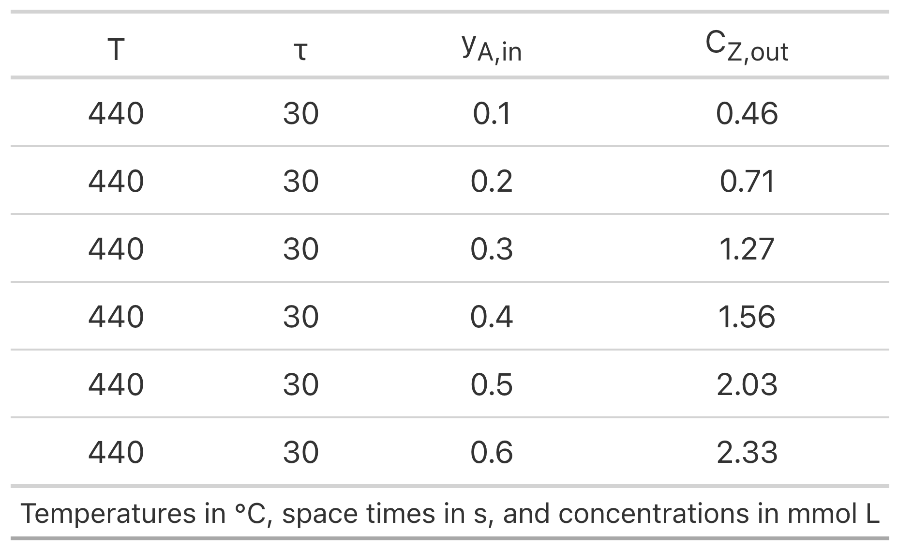{#tbl-practice_28_data width="40%"}

[Practice Assignment 28 Solution](practice/class_28/Practice%20Assignment%2028.pdf)

[Practice Assignment 28 Calculations](practice/class_28/practice_28.py)

---



$$
A + B \rightarrow Y + Z \tag{1}
$$

$$
r=kC_AC_B \tag{2}
$$

The experimental data are provided in the file, [practice_29_data.csv](practice/class_29/practice_29_data.csv). The first few data points from that file are shown in @tbl-practice_29_data.

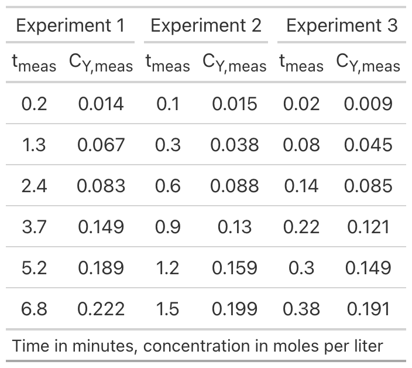{#tbl-practice_29_data width="40%"}

[Practice Assignment 29 Solution](practice/class_29/Practice%20Assignment%2029.pdf)

[Practice Assignment 29 Calculations](practice/class_29/practice_29.py)

## Additional Assignments for Extra Practice {.ch}

Additional assignments will be added as they become available.



